# 🔥🔥 Library Management System   

Star⭐ the repo if you like what you see😉.

## ✨ Demo available on PlayStore. 

- Login for Admin - Mail: pronabsen18@gmail.com | Pass: 123456
- Create new account for User

## ✨ Requirements
* Any Operating System (ie. MacOS X, Linux, Windows)
* Any IDE with Flutter SDK installed (ie. IntelliJ, Android Studio, VSCode etc)
* A little knowledge of Dart and Flutter
* A brain to think 🤓🤓

## Building and running the code [ **Updated** ]

- Should work on all platforms with Flutter Stable Release

## Packages Used

- 

## 🤓 Author(s)

- **Pronab Sen Gupta** 

## 📸 ScreenShots

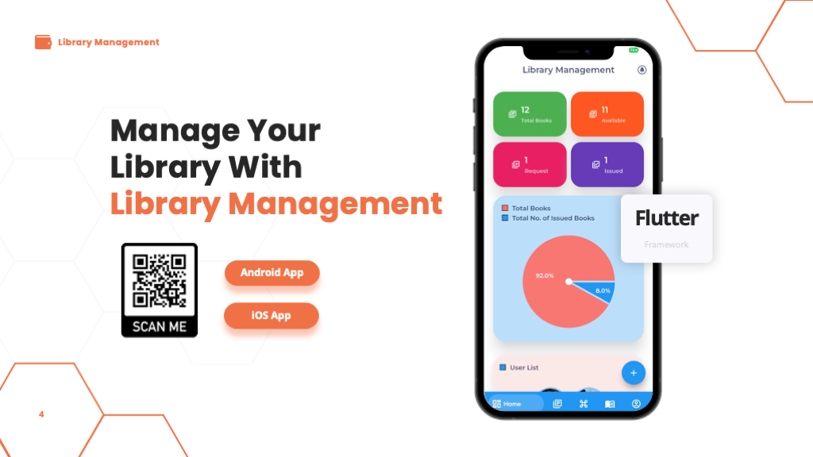
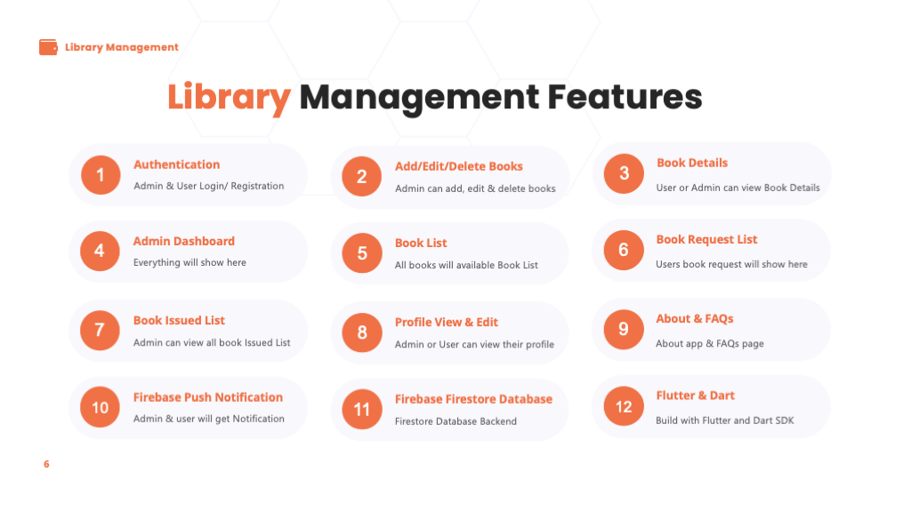

 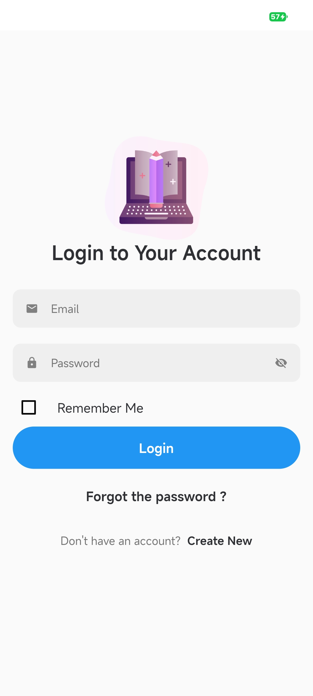 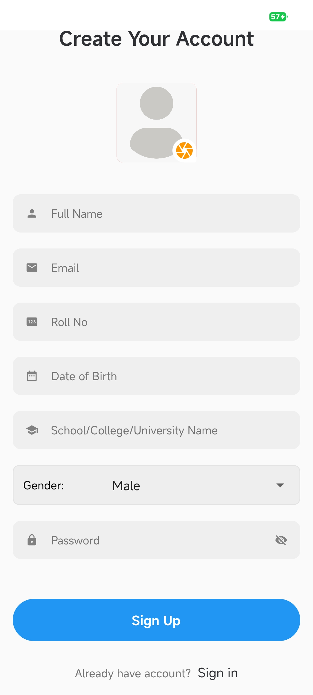 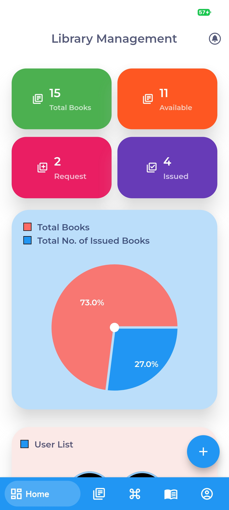 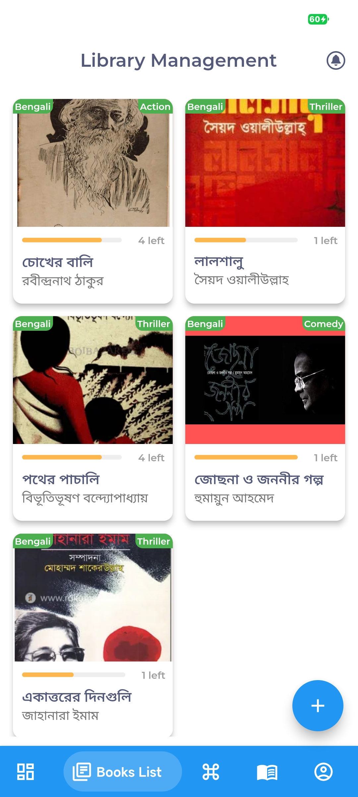 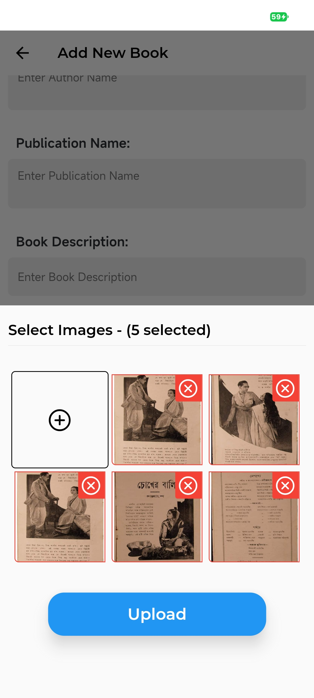 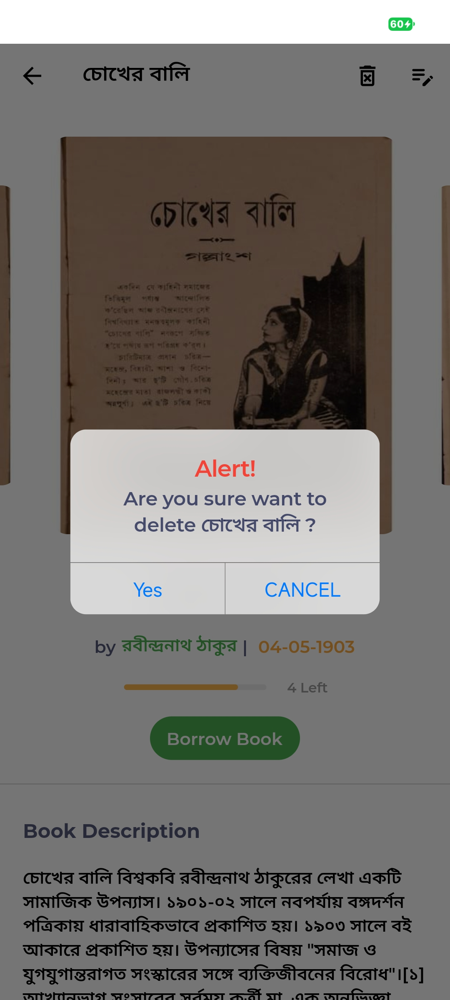 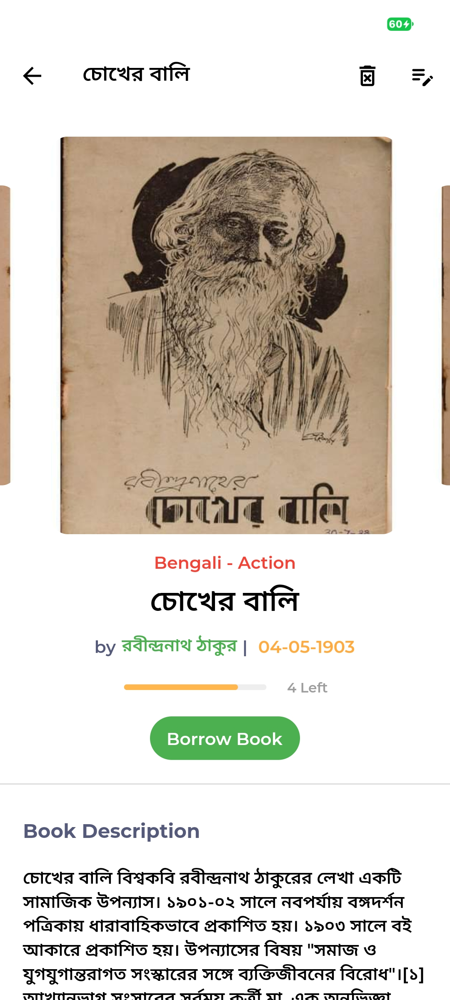 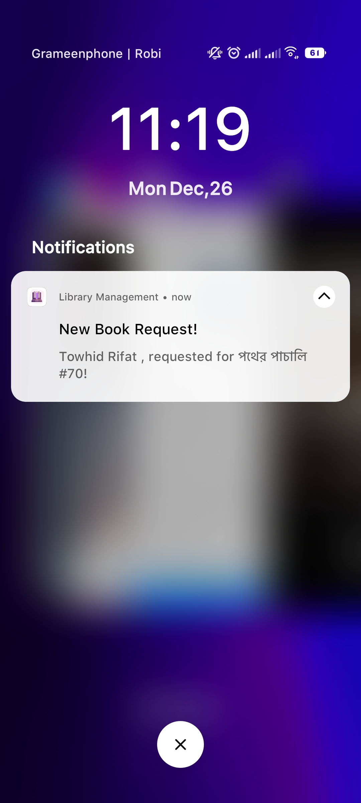 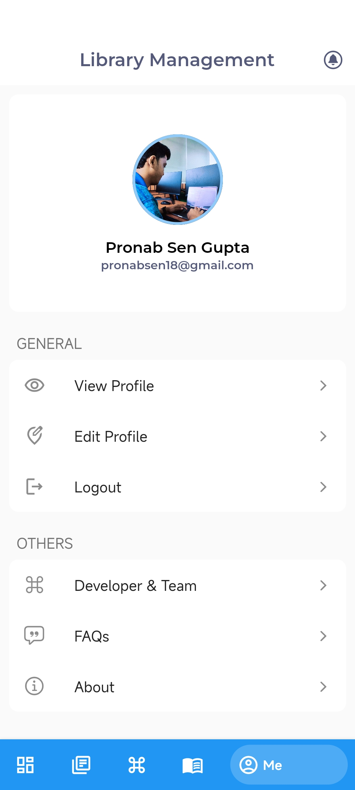 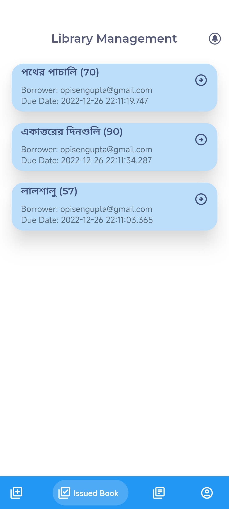 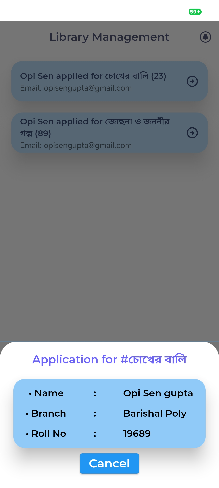 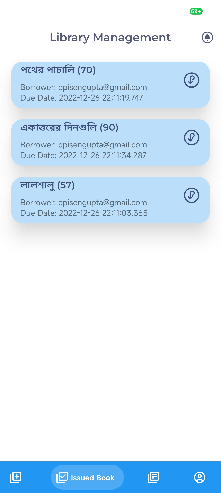 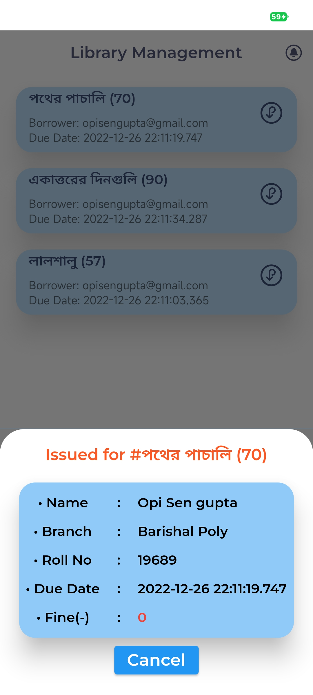 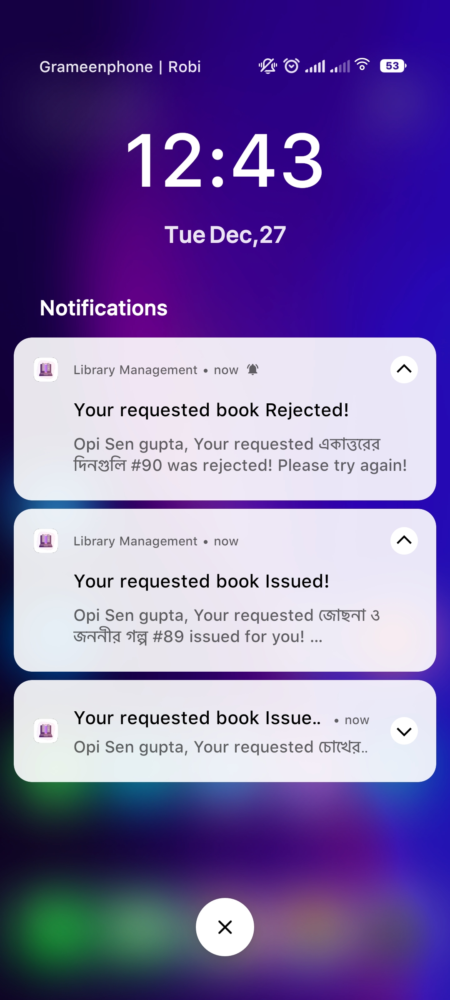 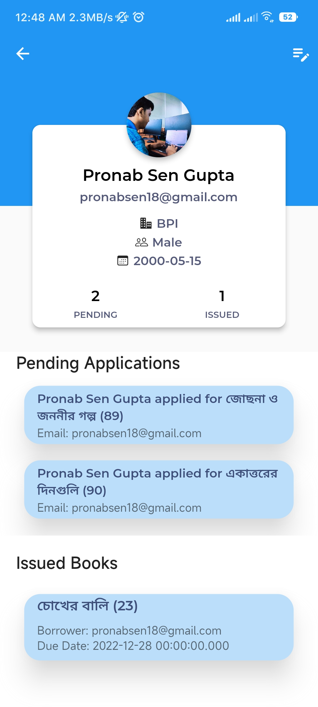 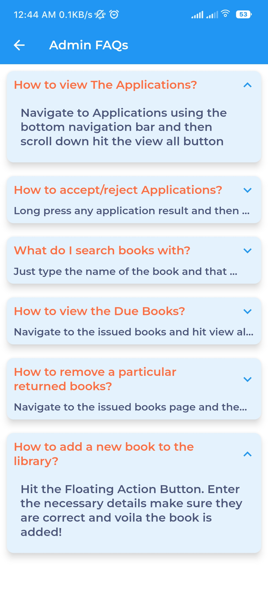

## 🔖 LICENCE
[WTFPL](http://www.wtfpl.net/about/)
